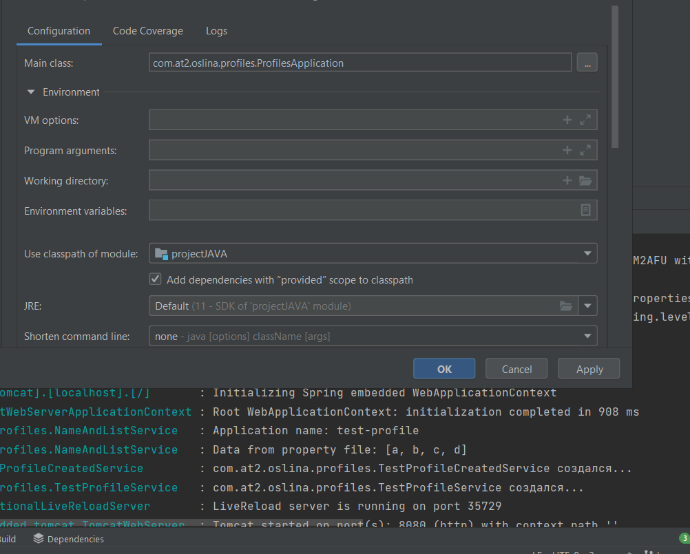
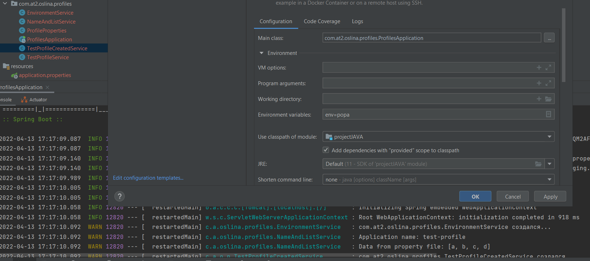

# Домашка 4

1) Создать 3 профиля - dev, test, prod, каждый из которых будет включать в себя:

   - конфиг с листом из нескольких значений
   - название приложения
   - конфиг с переменной окружения, по дефолту значение - default
3) 3 бина:
   - один создается, только если профиль test,
   - другой, если существует первый бин,
   - третий, если в конфиге с не “default” (тут в идеале со скриншотом)

Запуск без переменной   

Запуск с переменной
