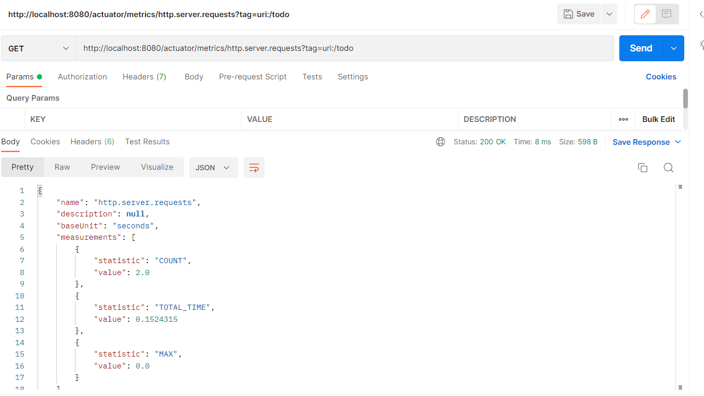

# По теме Обслуживание

1) Создать (можно использовать существующее из предыдущих заданий) веб приложение которое бы отдавало следующие метрики:
   —количество запросов
   —время выполнения запроса
2) Создать свою метрику. Например количество пользователей онлайн. Можно сделать счетчик который увеличивается через определенный интервал и его результат отдавать в метриках приложения
3) Создать свой актуатор. Например, при вызове которого в лог выводилось сообщение с датой и временем вызова актуатора

После включения метрик в файле свойств, можно получить доступ к метрике 
http.server.request и с помощью тэгов, получить информацию по всем эндпоинтам
приложения
