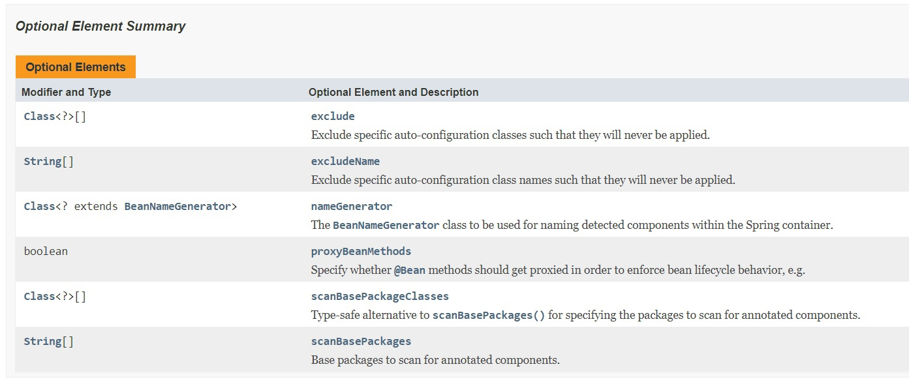

# Домашка №2

Всего в @SpringBootApplication 6 переменных:
-exclude
-excludeName
-nameGenerator
-proxyBeanMethods
-scanBasePackageClasses
-scanBasePackages

## exclude
@AliasFor(annotation=EnableAutoConfiguration.class)

public abstract Class<?>[] exclude

Returns:
the classes to exclude

Default:
{}

Исключает определенные классы автоматической настройки таким образом,
чтобы они никогда не применялись.

## excludeName

@AliasFor(annotation=EnableAutoConfiguration.class)

public abstract String[] excludeName

Returns:
the class names to exclude

Исключает определенные имена классов автоматической настройки таким образом, чтобы они никогда не применялись.

## scanBasePackages

@AliasFor(annotation=org.springframework.context.annotation.ComponentScan.class,
attribute="basePackages")

public abstract String[] scanBasePackages

Returns:
base packages to scan

Базовые пакеты для сканирования на наличие аннотированных компонентов.
Стоит использовать scanBasePackageClasses() для типобезопасной альтернативы именам пакетов на основе строк.
Примечание: этот параметр является псевдонимом только для @ComponentScan.
Это не влияет на сканирование @Entity или сканирование хранилища данных Spring.
Для них нужно добавить @EntityScan и @Enable...Аннотации репозиториев.

## scanBasePackageClasses

@AliasFor(annotation=org.springframework.context.annotation.ComponentScan.class,
attribute="basePackageClasses")

public abstract Class<?>[] scanBasePackageClasses

Returns:
base packages to scan

Типобезопасная альтернатива scanBasePackages() для указания пакетов для сканирования на наличие аннотированных компонентов. Пакет каждого указанного класса будет отсканирован.

Примечание: этот параметр является псевдонимом только для @ComponentScan.
Это не влияет на сканирование @Entity или сканирование хранилища данных Spring. Для них вы должны добавить @EntityScan и @Enable...Аннотации репозиториев.

## nameGenerator

@AliasFor(annotation=org.springframework.context.annotation.ComponentScan.class,
attribute="nameGenerator")

public abstract Class<? extends BeanNameGenerator> nameGenerator

Returns:
BeanNameGenerator to use

Класс BeanNameGenerator, использующийся для присвоения имен обнаруженным компонентам в контейнере Spring.
Значение по умолчанию самого интерфейса BeanNameGenerator указывает, что сканер, используемый для обработки этой аннотации @SpringBootApplication,
должен использовать свой унаследованный
генератор имен компонента, например, аннотацию по умолчанию Beannamegenerator или любой пользовательский экземпляр, предоставляемый контексту приложения во время начальной загрузки.

## proxyBeanMethods

@AliasFor(annotation=org.springframework.context.annotation.Configuration.class)
public abstract boolean proxyBeanMethods

Returns:
whether to proxy @Bean methods

Указание, должны ли методы @Bean проксироваться для обеспечения соблюдения поведения жизненного цикла компонента, например, для возврата
общих экземпляров одноэлементного компонента даже в случае прямых вызовов метода @Bean в пользовательском коде.
Эта функция требует перехвата методов, реализованного с помощью подкласса CGLIB, созданного во время выполнения, который поставляется с такими ограничениями,
как класс конфигурации и его методы, которым не разрешается объявлять final.
Значение по умолчанию равно true, что позволяет использовать "ссылки между компонентами" внутри класса конфигурации,
а также для внешних вызовов методов @Bean этой конфигурации, например, из другого класса конфигурации. Если это не требуется, поскольку каждый из методов
@Bean этой конкретной конфигурации является автономным и разработан как простой фабричный метод для использования в контейнере, стоит установить этот флаг в значение false, чтобы избежать обработки подкласса CGLIB.

Отключение перехвата метода компонента эффективно обрабатывает методы @Bean по отдельности, как при объявлении в классах, отличных от @Configuration, также известных как "Облегченный режим @Bean".

Одну аннотацию @SpringBootApplication можно использовать для включения этих трех функций, а именно:

@EnableAutoConfiguration: включить механизм автоконфигурации Spring Boot

@ComponentScan: включить сканирование @Component для пакета, в котором находится приложение

@Configuration: позволяет регистрировать дополнительные компоненты (beans) в контексте или импортировать дополнительные классы конфигурации

@SpringBootApplication также предоставляет псевдонимы для настройки атрибутов @EnableAutoConfiguration и @ComponentScan.