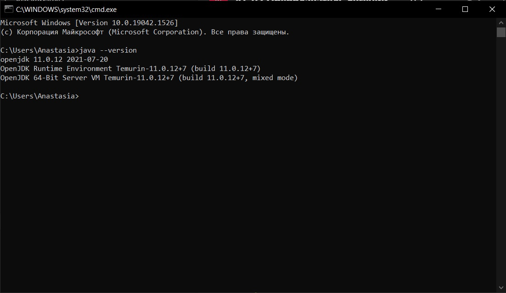
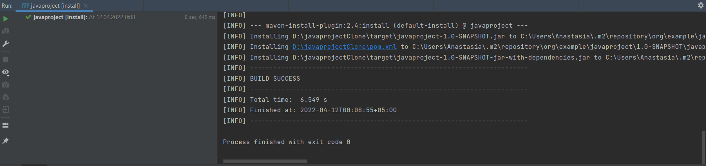
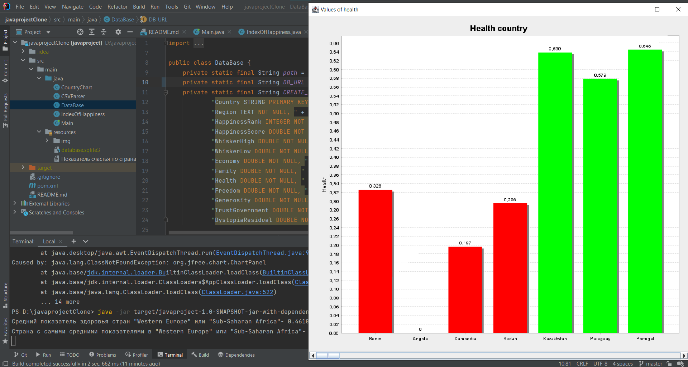

## Домашняя работа №1

# - JRE и JDK

# - Maven/gradle
-Ранее я уже использовала maven для сборки своего прошлогоднего проекта, поэтому прикреплю ссылку на свой репозиторий:
https://github.com/malinaboky/javaproject

-Также прикреплю скриншот самой сборки

-И пример запущенной программы
